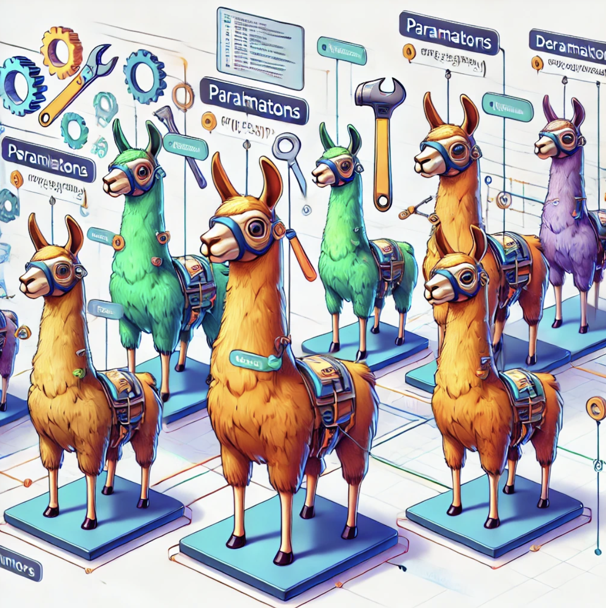
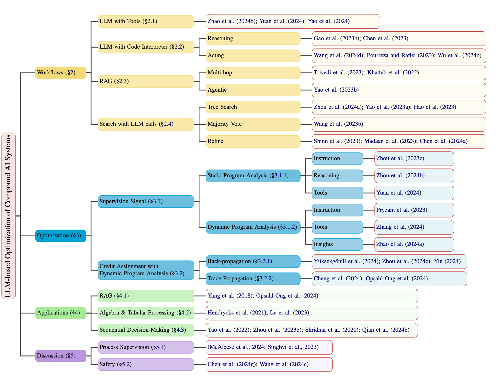

# LLM-based Optimization of Compound AI Systems





This repository is a collection of influential papers and resources related to LLM-based optimization of compound AI systems as explored in the survey paper titled “LLM-based Optimization of Compound AI Systems: A Survey”.

For more information please refer to our [survey paper](https://arxiv.org/abs/2410.16392) or [twitter thread](https://x.com/capybara_ai/status/1848895997600272566).

## 📚 Papers



### 1. Workflow: Design of a Compound AI System


#### 1.1 LLM with Tools

- **Title**: [CRAFT: Customizing LLMs by Creating and Retrieving from Specialized Toolsets](https://openreview.net/forum?id=G0vdDSt9XM), ICLR, 2024.  
**Authors**: Lifan Yuan, Yangyi Chen, Xingyao Wang, Yi Fung, Hao Peng, Heng Ji
**TL;DR**: At training time, create a tool for each task and retrieve the most relevant tool at test time. 

- **Title**: [\(\tau\)-bench: A Benchmark for Tool-Agent-User Interaction in Real-World Domains](https://doi.org/10.48550/arXiv.2406.12045), arxiv, 2024.  
**Authors**: Shunyu Yao, Noah Shinn, Pedram Razavi, Karthik Narasimhan
**TL;DR**: Multi-turn tool-use benchmark. 

#### 1.2 LLM with Code Interpreter

- **Title**: [PAL: Program-aided Language Models](https://proceedings.mlr.press/v202/gao23f.html), ICML, 2023.  
**Authors**: Luyu Gao, Aman Madaan, Shuyan Zhou, Uri Alon, Pengfei Liu, Yiming Yang, Jamie Callan, Graham Neubig
**TL;DR**: Perform reasoning by outputting code. 

- **Title**: [Program of Thoughts Prompting: Disentangling Computation from Reasoning for Numerical Reasoning Tasks](https://openreview.net/forum?id=YfZ4ZPt8zd), Trans. Mach. Learn. Res., 2023.  
**Authors**: Wenhu Chen, Xueguang Ma, Xinyi Wang, William W. Cohen
**TL;DR**: Perform reasoning by outputting code. 

- **Title**: [Executable Code Actions Elicit Better LLM Agents](https://openreview.net/forum?id=jJ9BoXAfFa), ICML, 2024.  
**Authors**: Xingyao Wang, Yangyi Chen, Lifan Yuan, Yizhe Zhang, Yunzhu Li, Hao Peng, Heng Ji
**TL;DR**: Use code to perform complex actions by structuring a code that calls multiple functions. 


- **Title**: [DIN-SQL: Decomposed In-Context Learning of Text-to-SQL with Self-Correction](http://papers.nips.cc/paper\_files/paper/2023/hash/72223cc66f63ca1aa59edaec1b3670e6-Abstract-Conference.html), Advances in Neural Information Processing Systems 36: Annual Conference
on Neural Information Processing Systems 2023, NeurIPS 2023, New Orleans,
LA, USA, December 10 - 16, 2023, 2023.  
**Authors**: Mohammadreza Pourreza, Davood Rafiei
**TL;DR**: Output SQL code.  


- **Title**: [StateFlow: Enhancing LLM Task-Solving through State-Driven Workflows](#), arXiv preprint arXiv:2403.11322, 2024.  
**Authors**: Wu, Yiran and Yue, Tianwei and Zhang, Shaokun and Wang, Chi and Wu, Qingyun
**TL;DR**: Output SQL code.  

#### 1.3 Retrieval Augmented Generation

- **Title**: [Interleaving Retrieval with Chain-of-Thought Reasoning for Knowledge-Intensive Multi-Step Questions](https://doi.org/10.18653/v1/2023.acl-long.557), ACL, 2023.  
**Authors**: Harsh Trivedi, Niranjan Balasubramanian, Tushar Khot, Ashish Sabharwal
**TL;DR**: Multi-hop rag. 

- **Title**: [Demonstrate-Search-Predict: Composing retrieval and language models for knowledge-intensive NLP](https://doi.org/10.48550/arXiv.2212.14024), arxiv, 2022.  
**Authors**: Omar Khattab, Keshav Santhanam, Xiang Lisa Li, David Hall, Percy Liang, Christopher Potts, Matei Zaharia
**TL;DR**: Framework for multi-hop rag.

- **Title**: [ReAct: Synergizing Reasoning and Acting in Language Models](https://openreview.net/forum?id=WE\_vluYUL-X), ICLR, 2023.  
**Authors**: Shunyu Yao, Jeffrey Zhao, Dian Yu, Nan Du, Izhak Shafran, Karthik R. Narasimhan, Yuan Cao
**TL;DR**: agentic rag by creating the wikipedia API on hotpotQA. 

#### 1.4 Search with LLM Calls

- **Title**: [Language Agent Tree Search Unifies Reasoning, Acting, and Planning in Language Models](https://openreview.net/forum?id=njwv9BsGHF), ICML, 2024.  
**Authors**: Andy Zhou, Kai Yan, Michal Shlapentokh-Rothman, Haohan Wang, Yu-Xiong Wang
**TL;DR**: MCTS over action space with multiple LLM calls where we have a generator and a evaluator.

- **Title**: [Tree of Thoughts: Deliberate Problem Solving with Large Language Models](http://papers.nips.cc/paper\_files/paper/2023/hash/271db9922b8d1f4dd7aaef84ed5ac703-Abstract-Conference.html), Advances in Neural Information Processing Systems 36: Annual Conference
on Neural Information Processing Systems 2023, NeurIPS 2023, New Orleans,
LA, USA, December 10 - 16, 2023, 2023.  
**Authors**: Shunyu Yao, Dian Yu, Jeffrey Zhao, Izhak Shafran, Tom Griffiths, Yuan Cao, Karthik Narasimhan
**TL;DR**: BFS/DFS with multiple LLM calls where we have a generator and a evaluator.

- **Title**: [Reasoning with Language Model is Planning with World Model](https://doi.org/10.18653/v1/2023.emnlp-main.507), EMNLP, 2023.  
**Authors**: Shibo Hao, Yi Gu, Haodi Ma, Joshua Jiahua Hong, Zhen Wang, Daisy Zhe Wang, Zhiting Hu
**TL;DR**: MCTS over reasoning space with multiple LLM calls where we have a generator and a evaluator.

- **Title**: [Self-Consistency Improves Chain of Thought Reasoning in Language Models](https://openreview.net/forum?id=1PL1NIMMrw), ICLR, 2023.  
**Authors**: Xuezhi Wang, Jason Wei, Dale Schuurmans, Quoc V. Le, Ed H. Chi, Sharan Narang, Aakanksha Chowdhery, Denny Zhou
**TL;DR**: CoT@k.

- **Title**: [Reflexion: language agents with verbal reinforcement learning](http://papers.nips.cc/paper\_files/paper/2023/hash/1b44b878bb782e6954cd888628510e90-Abstract-Conference.html), Advances in Neural Information Processing Systems 36: Annual Conference
on Neural Information Processing Systems 2023, NeurIPS 2023, New Orleans,
LA, USA, December 10 - 16, 2023, 2023.  
**Authors**: Noah Shinn, Federico Cassano, Ashwin Gopinath, Karthik Narasimhan, Shunyu Yao
**TL;DR**: Requires an environment that allows to retry actions. It uses a previously failed action and uses an LLM to reflect on it to come up with a better action.

- **Title**: [Self-Refine: Iterative Refinement with Self-Feedback](http://papers.nips.cc/paper\_files/paper/2023/hash/91edff07232fb1b55a505a9e9f6c0ff3-Abstract-Conference.html), Advances in Neural Information Processing Systems 36: Annual Conference
on Neural Information Processing Systems 2023, NeurIPS 2023, New Orleans,
LA, USA, December 10 - 16, 2023, 2023.  
**Authors**: Aman Madaan, Niket Tandon, Prakhar Gupta, Skyler Hallinan, Luyu Gao, Sarah Wiegreffe, Uri Alon, Nouha Dziri, Shrimai Prabhumoye, Yiming Yang, Shashank Gupta, Bodhisattwa Prasad Majumder, Katherine Hermann, Sean Welleck, Amir Yazdanbakhsh, Peter Clark
**TL;DR**: Generate an initial output using an LLM; then, the same LLM provides feedback for its output and uses it to refine itself, iteratively.

- **Title**: [MAgICoRe: Multi-Agent, Iterative, Coarse-to-Fine Refinement for Reasoning](https://arxiv.org/abs/2409.12147), Arxiv, 2024.  
**Authors**: Justin Chih-Yao Chen and Archiki Prasad and Swarnadeep Saha and Elias Stengel-Eskin and Mohit Bansal
**TL;DR**: Generate an initial output using an LLM; then, the same LLM provides feedback for its output and uses it to refine itself, iteratively.

### 2. Optimization


## 🛠️ How to Contribute

Contributions to this repository are welcome! If you would like to add a new paper or resource, please follow these steps:

	1.	Fork the repository.
	2.	Create a new branch (git checkout -b feature-paper-contribution).
	3.	Add your paper or resource to the papers/ directory.
	4.	Commit your changes (git commit -m 'Added new paper: [Paper Title]').
	5.	Push to the branch (git push origin feature-paper-contribution).
	6.	Open a Pull Request and provide a brief description of your contribution.


## 📬 Contact

For any questions or feedback, feel free to reach out to me at linmatthieu@gmail.com

## 📝 How to Cite the Survey

If you find this repository useful in your research, please consider citing the survey paper:
```
@misc{lin2024llmbasedoptimizationcompoundai,
      title={LLM-based Optimization of Compound AI Systems: A Survey}, 
      author={Matthieu Lin and Jenny Sheng and Andrew Zhao and Shenzhi Wang and Yang Yue and Yiran Wu and Huan Liu and Jun Liu and Gao Huang and Yong-Jin Liu},
      year={2024},
      eprint={2410.16392},
      archivePrefix={arXiv},
      primaryClass={cs.CL},
      url={https://arxiv.org/abs/2410.16392}, 
}
```

